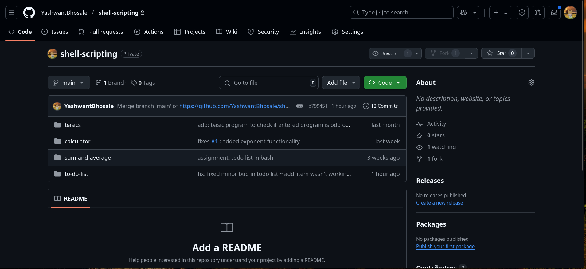
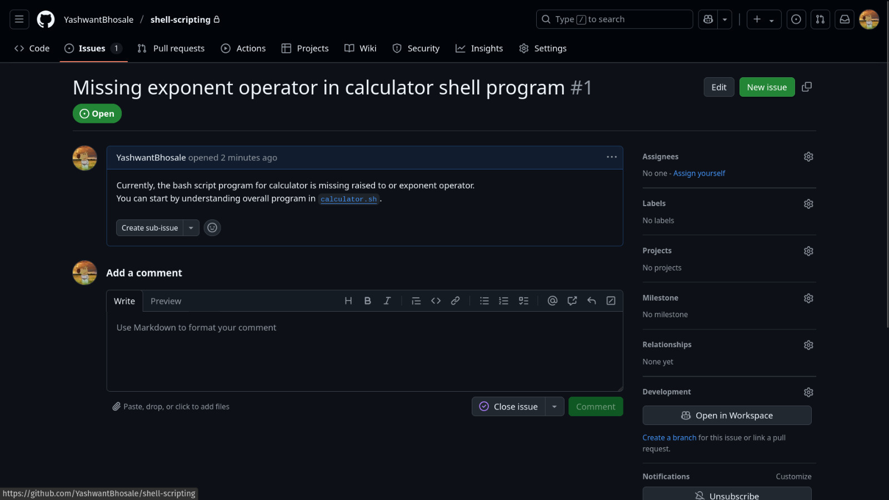
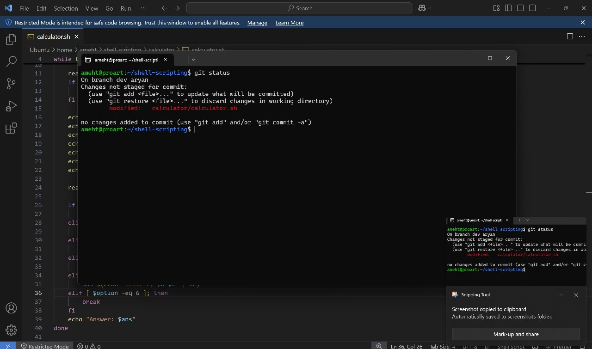
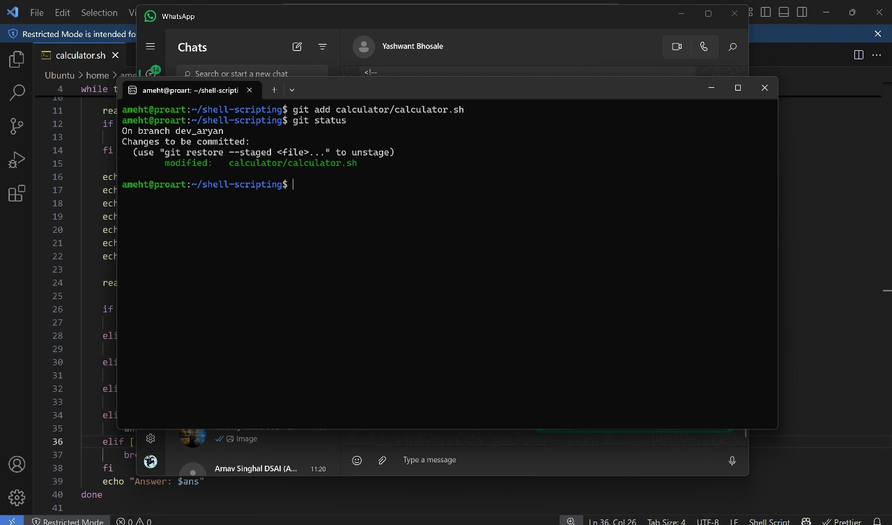
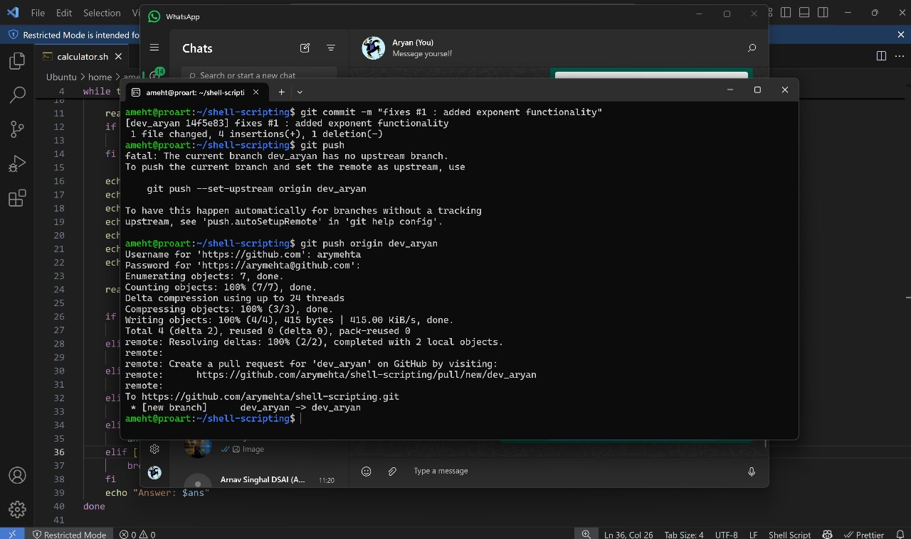
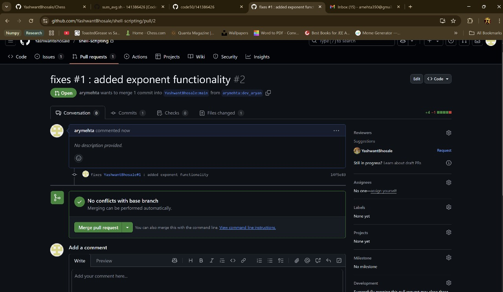
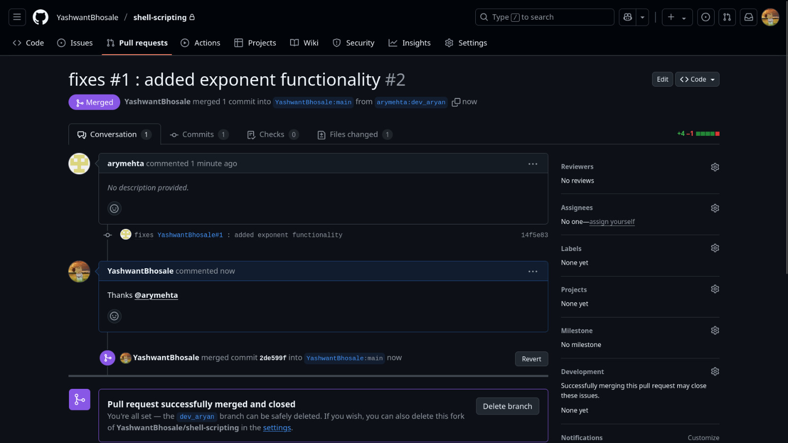
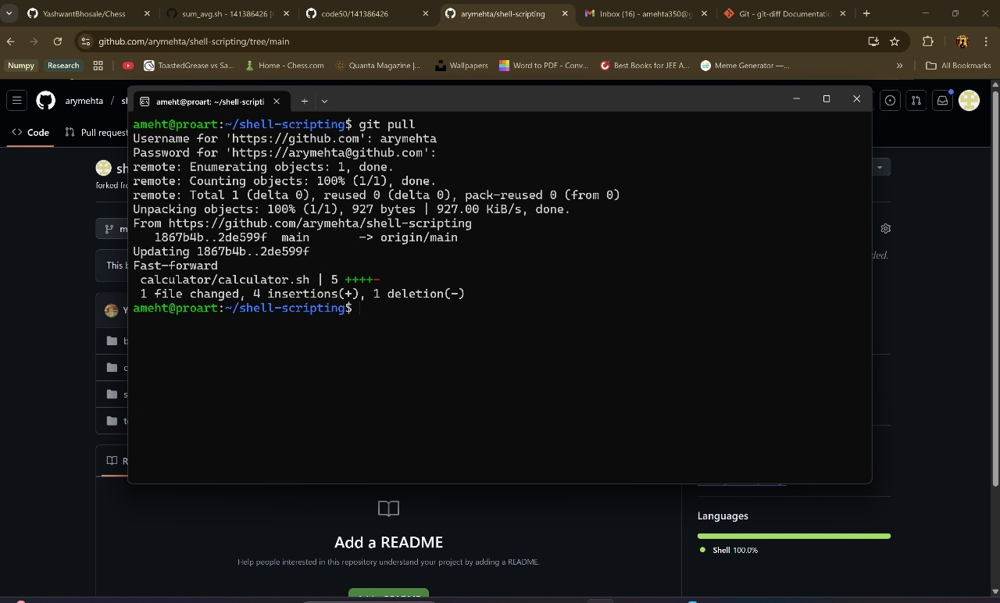
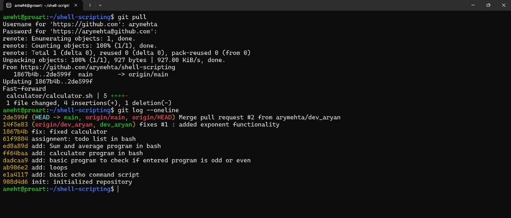
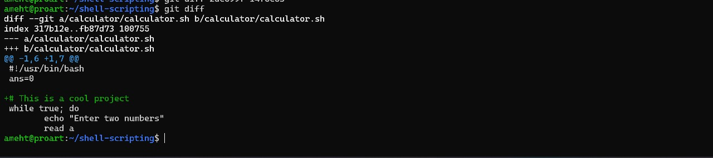

### Overview
This assignment was designed to learn how to use Git and GitHub for version control and collaboration on software projects. The assignment involved creating a repository, opening issue, creating branches, making commits, and merging branches. The goal was to understand the basic concepts of Git and GitHub and how they can be used in software development.

### Flow
For context, I (username: **`YashwantBhosale`**) am playing the role of a **Maintainer** and my friend (username: **`arymehta`**) is playing the role of a **Contributor**. The following steps outline the process we followed to complete the assignment:

1. **Repository**: We could either create a new repository or use an existing one. In this case, we used an existing repository which contained `calculator.sh`- calculator program in shell scripting assignment.

2. **Issue**: I opened an issue in the repository to discuss the changes I wanted to make. The issue was titled "Missing exponent operator in calculator shell program" and described the changes I wanted to make.

3. **Branch**: My friend **forked** (copied) the repository to their own GitHub account and created a new branch called `dev_aryan` to work on the changes. This allowed them to work on the changes without affecting the main branch of the original repository.
4. **Clone**: They cloned the forked repository to their local machine using the command `git clone <repository-url>`. This allowed them to work on the changes locally.
5. **Check Status**: They checked the status of the repository using the command `git status`. This showed them which files had been modified and which files were untracked.

6. **Add Changes**: They added the changes to the staging area using the command `git add <file-name>`. This allowed them to prepare the changes for commit. and then ran the command `git status` again to check the status of the repository. This showed them that the changes were now in the staging area and ready to be committed.

7. **Commit Changes**: They committed the changes using the command `git commit -m "<commit-message>"`. This created a new commit with the changes they made and added a message describing the changes. then they pushed the changes to the remote repository using the command `git push origin <branch-name>`. This uploaded the changes to the forked repository on GitHub.
**Note: Here, we carefully used `fixes #1` in the commit message this is gitHub feature. When we push the commit to the main branch, it will automatically close the issue.**

8. **Pull Request**: After pushing the changes, they opened a pull request in the original repository. This allowed them to propose the changes to the original repository and request that the changes be merged into the main branch. They provided a description of the changes and linked to the issue that was fixed by the changes.

9. **Merge**: After the pull request was reviewed and approved, the changes were merged into the main branch of the original repository. This allowed the changes to be incorporated into the main codebase.

10. **Check status**: After merging, changes were pulled from the original repository to the local machine using the command `git pull origin <branch-name>`. This updated the local repository with the latest changes from the original repository.

11. **Confirm commits**: Finally, they checked the commit history using the command `git log --oneline` to confirm that the changes were successfully merged into the main branch. This showed them a list of all commits in the repository, including the new commit that was just merged.

12. **git diff**: For simple demonstration, we added a comment in the `calculator.sh` file and then used the command `git diff` to see the changes made in the file. This showed them a side-by-side comparison of the changes made to the file, highlighting the differences between the original and modified versions.

#### Student Information
- **Name**: Bhosale Yashwant Chandrakant
- **MIS**: 612303039
- **Batch**: S2 (Division 1)
