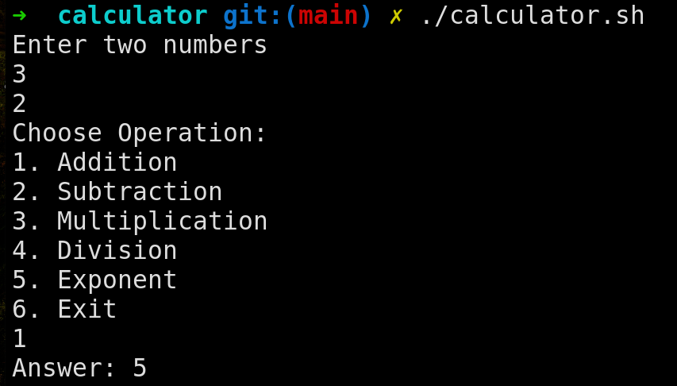
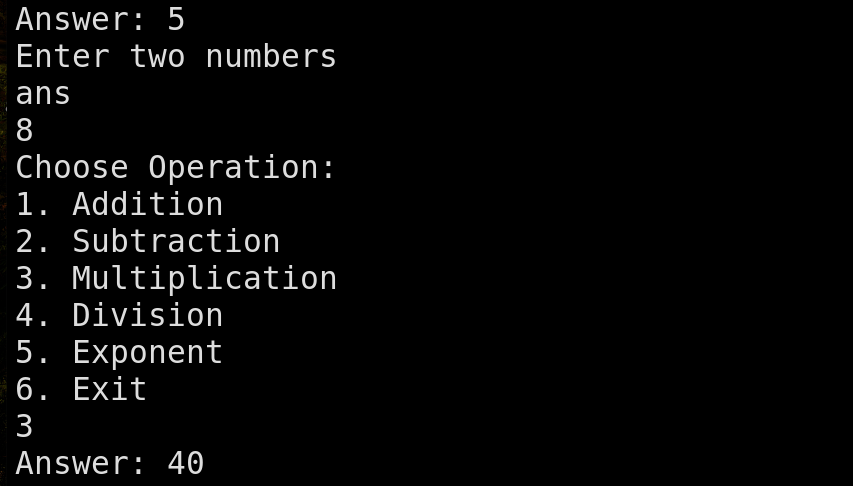

### Overview
This is simple calculator program written in shell script. It is basic calculator which has basic five operations
- Addition (+)
- Subtraction (-)
- Multiplication (x)
- Division (/)
- Exponent (^)

You can find the file here:- [calculator.sh](./calculator.sh) (Simply, click on the file name to open it)

#### How to use the program?
1. First, we need to give execution permission to the shell script. Open terminal and make sure you are in the correct directory i.e `shell-scripting-assignments/calculator`.
Execute following command to give execution permission
```bash
chmod +x calculator.sh
```
2. Simply, run the script
```bash
./calculator.sh
```
3. How to run?
    1. You first need to enter two numbers on which operation is to be performed.
    2. Then choose the operation using numbers given in the menu.
    ex. 
    3. After that, the result will be displayed on the screen. If you wish to use the result of this operation in the next operation, you can pass `ans` as either first or second number.
    ex. 
    4. If you wish to exit you can either press `Ctrl + C` or enter option 6 **After** entering the numbers.

#### Student Information
- **Name**: Bhosale Yashwant Chandrakant
- **MIS**: 612303039
- **Batch**: S2 (Division 1)