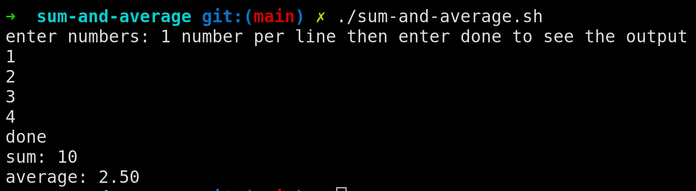

### Overview
The problem statement of this assignment is to **write a shell script that takes any number of integers as input and calculates the sum and average of those numbers.**

Source code of the shell script is given below. You can find the file here:- [sum-and-average.sh](./sum-and-average.sh) (Simply, click on the file name to open it)

#### How to use the program?
1. First, we need to give execution permission to the shell script. Open terminal and make sure you are in the correct directory i.e `shee-scripting-assignments/sum-and-average`.
Execute following command to give execution permission
```bash
chmod +x sum-and-average.sh
```
2. Simply, run the script
```bash
./sum-and-average.sh
```
3. How to run?
    1. You first need to enter the numbers ~ 1 number per line.
    2. Press `Enter` key after each number.
    3. After entering all the numbers, write `done` and press `Enter`.
    4. The script will then calculate the sum and average of the numbers you entered.
    5. The result will be displayed on the screen.
    ex. 

#### Student Information
- **Name**: Bhosale Yashwant Chandrakant
- **MIS**: 612303039
- **Batch**: S2 (Division 1)