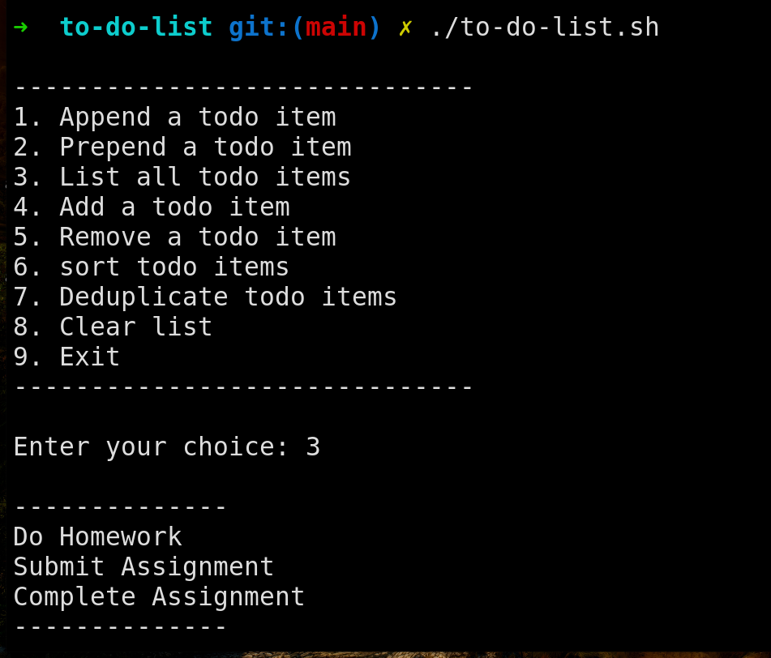
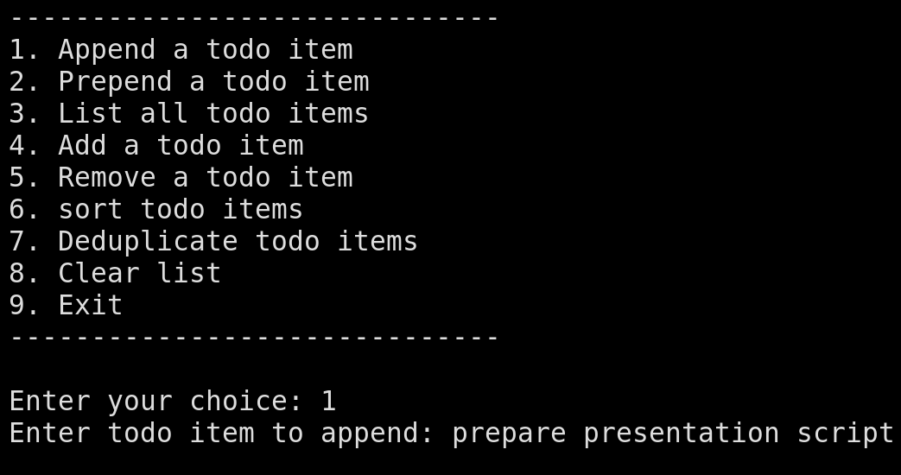

### Overview
The problem Statement was to : **write a shell script to manage a todo list from command line. The script should be able to add, remove, list, prepend, append, deduplicate todo items.**

Source code of the shell script is given below. You can find the file here:- [to-do-list.sh](./to-do-list.sh) (Simply, click on the file name to open it)

**Note: The script needs todo.txt file to be present in the same directory. The script will create the file if it does not exist.**

#### Features
Features are pretty straightforward. The script can do the following:
    1. Append a todo item to the end of the list.
    2. Prepend a todo item to the beginning of the list.
    3. Display all todo items in the list.
    4. Add a todo item at a specific index.
    5. Remove a todo item by its index.
    6. Sort the todo items alphabetically.
    7. Remove duplicate todo items from the list.
    8. Clear all items from the list.
    9. Exit the script.
**Note: Wherever `index` is required it always starts with `1`. `index` always refers to task number.**

### Usage
1. First, we need to give execution permission to the shell script. Open terminal and make sure you are in the correct directory i.e `shell-scripting-assignments/to-do-list`.
Execute following command to give execution permission
```bash
chmod +x to-do-list.sh
```
2. Simply, run the script
```bash
./to-do-list.sh
```
3. How to use?
    1. You will see a menu with options.
    2. Enter the number corresponding to the option you want to perform.
    3. Follow the instructions given in the script.
    4. ex:
        - View the todo list
            

        - append a todo item
            

#### Student Information
- **Name**: Bhosale Yashwant Chandrakant
- **MIS**: 612303039
- **Batch**: S2 (Division 1)

